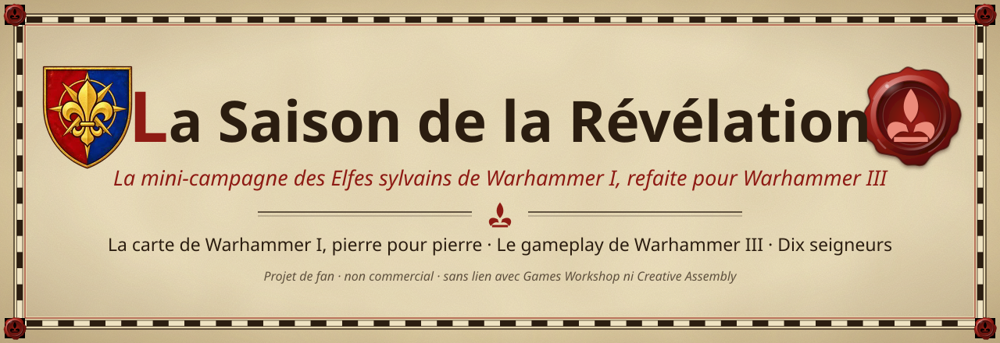

<a href="https://bretonia.dev"><b>Atlas de Bretonnie</b></a> ·
<a href="https://bretonia.dev/#film"><b>Voir le film</b></a> ·
<a href="MODDERS.md"><b>Guide des moddeurs (EN)</b></a> ·
<a href="README.md"><b>Read in English</b></a> ·
<a href="https://github.com/LeyZee/the-season-of-revelation-expanded"><b>Expanded</b></a>

En 2016, *Le Royaume des Elfes Sylvains* apportait une petite campagne magnifique : **la Saison de la Révélation**, un
automne à Athel Loren, pendant que les hardes de Morghur se rassemblent et que le Chêne des Âges appelle ses seigneurs.
Ce projet la porte dans **Total War: WARHAMMER III (patch 9.0)**. La carte et l'histoire sont celles de Warhammer I,
intactes, le gameplay est celui de Warhammer III, et dix seigneurs légendaires sont jouables.

##  D'un coup d'œil

| | |
|---|---|
| **La carte** | Celle de la mini-campagne de Warhammer I, telle quelle : 400 × 440 hex, 61 régions, mêmes reliefs, objets, arbres, textures et eaux. Warhammer III n'ajoute que ce qui manquait. |
| **L'histoire** | La *Saison de la Révélation* de Warhammer I : le Chêne des Âges, les invasions de Morghur, la bataille du Pic d'Argent ; et une chronique pour chaque seigneur. |
| **Le gameplay** | Celui de Warhammer III 9.0, en entier : lignées vampiriques et Décrets de sang, Forge de Daith, marmite de Grom, Chasse Sauvage, victoires de la 9.0. |
| **Les seigneurs** | Dix, chacun avec une victoire courte et une longue qui lui sont propres, écrites d'après le lore. |
| **Le ton** | Plus dur que le jeu de base, et grimdark : une menace du lore reste une menace. |
| **État** | **Bêta, sur le [Steam Workshop](https://steamcommunity.com/sharedfiles/filedetails/?id=3807973986)** (en anglais), avec la [traduction française](https://steamcommunity.com/sharedfiles/filedetails/?id=3808029376) en objet à part (activer les deux). Demande *Le Royaume des Elfes Sylvains*. Compatibilité avec les autres mods non testée : dites-nous ce qui casse. |

##  Ce que contient ce dépôt (et ce qu'il ne contient pas)

**Il contient** tout ce que nous avons écrit pour ce portage : les outils de construction (Python), les scripts de
campagne (Lua), tous nos textes (français et anglais), les lots de données, et toute la documentation de l'atelier,
y compris chaque erreur commise et la règle qui l'évite désormais.

**Il ne contient pas** le mod jouable. Le pack contient des fichiers convertis de Warhammer I : il n'est jamais publié
ici. Aucun fichier de Warhammer I ni de Creative Assembly : ni modèles, ni textures, ni terrain, ni position de départ,
ni pack. Pour reconstruire la carte, il faut ses propres exemplaires des deux jeux et de leurs Assembly Kits (voir
[NOTICE](NOTICE.md)).

##  Les dix seigneurs

| Seigneur | Faction | Contenu requis |
|---|---|---|
| **Orion** | Les Elfes sylvains d'Athel Loren | Le Royaume des Elfes Sylvains |
| **Durthu** | Argwylon | Le Royaume des Elfes Sylvains |
| **Drycha** | Les esprits de la forêt de Drycha | Le Royaume des Elfes Sylvains |
| **Les Sœurs du Crépuscule** | Les Sœurs du Crépuscule | The Twisted & The Twilight |
| **Albéric de Bordeleaux** | Bordeleaux | Bretonnie (gratuit) |
| **La Fée Enchanteresse** | Carcassonne | Bretonnie (gratuit) |
| **Morghur** | La harde de l'Enfant de l'Ombre | L'Appel des Hommes-bêtes |
| **Le Duc écarlate** | Mousillon | Total War: WARHAMMER |
| **Heinrich Kemmler** | La Légion des Tertres | Total War: WARHAMMER |
| **Grom la Panse** | La Hache Brisée | The Warden & The Paunch |

La campagne demande *Le Royaume des Elfes Sylvains* : sans lui, le bouton **Lancer** est grisé au menu, avec un
message. Chaque seigneur demande aussi le contenu qui le débloque aux Empires Immortels.

##  Comment le portage est construit

- **Clés.** Tout ce que nous créons est clé `saison_…` ; ce qui vient de Warhammer I garde ses clés `wh_dlc05_…`.
  Aucune table ni ligne de Creative Assembly n'est écrasée : les Empires Immortels marchent avec le mod actif.
- **Les données de jeu** sont écrites par des *lots* documentés, datés, rejouables sans effet
  (`donnees_campagne.py --lot etapeN [--apply]`).
- **Les scripts de campagne** démarrent un système à la fois, chacun protégé : un écouteur en erreur est écrit au
  journal et n'arrête jamais les autres.
- **Tous les textes** sont dans un seul fichier, en français et en anglais, vérifiés avant chaque pack.

Le schéma de la chaîne est dans le [README anglais](README.md#how-the-port-is-built).

##  Pour commencer

1. Lire **[MODDERS.md](MODDERS.md)** (en anglais) : prérequis, réglage de la machine, construction d'un pack, pièges.
2. Régler les chemins : copier `atelier_local.json.example` en `atelier_local.json`, puis vérifier avec
   `python 02-scripts/chemins_atelier.py`.
3. La documentation de l'atelier est dans [`docs/atelier/`](docs/atelier/) : `GUIDE.md` § 15 pour les pièges connus,
   `ERREURS-ET-LECONS.md` pour la raison de chaque règle.

##  Participer

C'est désormais un projet communautaire, et les collaborations sont ouvertes. Toute aide est bienvenue :

- **Jouer la bêta** ([Steam Workshop](https://steamcommunity.com/sharedfiles/filedetails/?id=3807973986)) et signaler bugs et plantages, avec vos journaux (voir la page
  Workshop).
- **Lore** : relire textes et victoires d'après les sources ; le porteur du projet garde le dernier mot.
- **Traductions** : tous les textes sont dans un seul fichier (`textes_gameplay.json`), en français et en anglais
  aujourd'hui.
- **Carte et code** : terrain, CAIME, Lua, données. Ouvrez une issue ou une pull request, ou venez en parler sur le
  Discord indiqué par [bretonia.dev](https://bretonia.dev).

##  Crédits

Un projet de fan de **LeyZee**, open source, par un passionné, pour d'autres passionnés, construit avec Claude Code. Outils : **CAIME** (Campaign Map Toolkit : MrJox,
Maruka, Marthenil, ChaosRobbie, Celebdil, Leoman, Ophis, Causeless, PeteCA, Mitch, CharlesWoodhill, TadeoM, Frodo,
Daniu, Ironic, OtherTomCA et ses testeurs ; notre fork : [LeyZee/CampaignMapToolkit](https://github.com/LeyZee/CampaignMapToolkit)),
**RPFM** de Frodo45127, et l'**Assembly Kit** de Creative Assembly. *La Saison de la Révélation*, sa carte et son
histoire : **Creative Assembly**.

##  Mentions

Warhammer et tous les noms associés appartiennent à **Games Workshop** ; Total War: WARHAMMER à **Creative Assembly**
et **SEGA**. Projet de fan **non commercial**, sans lien avec eux ni approbation de leur part. Notre code est sous
[licence MIT](LICENSE) ; la [NOTICE](NOTICE.md) dit ce qu'elle couvre et ce qu'elle ne couvre pas.
