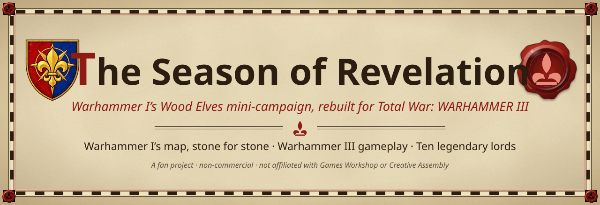
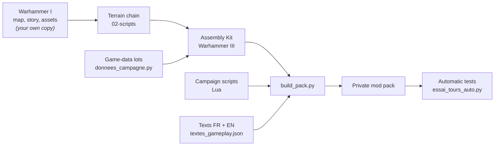

<p align="center"></p>

<p align="center">
<a href="https://bretonia.dev"><b>Atlas of Bretonnia</b></a> ·
<a href="https://bretonia.dev/#film"><b>Watch the film</b></a> ·
<a href="MODDERS.md"><b>Modder's guide</b></a> ·
<a href="README.fr.md"><b>Lire en français</b></a> ·
<a href="https://github.com/LeyZee/the-season-of-revelation-expanded"><b>Expanded</b></a>
</p>

In 2016, *Realm of the Wood Elves* shipped a small, beautiful campaign: **The Season of Revelation**, one autumn in
Athel Loren while Morghur's herds gather and the Oak of Ages calls its lords. This project brings that campaign into
**Total War: WARHAMMER III (patch 9.0)**. The map is Warhammer I's, untouched, the story is Warhammer I's, and the
gameplay is Warhammer III's, with ten legendary lords to play.

<p align="center"></p>

##  At a glance

| | |
|---|---|
| **The map** | Warhammer I's mini-campaign map, kept as it was: 400 × 440 hexes, 61 regions, same relief, props, trees, textures and water. Warhammer III adds only what was missing. |
| **The story** | Warhammer I's *Season of Revelation*: the Oak of Ages, Morghur's invasions, the battle at the Silver Pinnacle; plus a chronicle for each lord. |
| **The gameplay** | Warhammer III 9.0, whole: vampire bloodlines and Blood Decrees, the Forge of Daith, Grom's cauldron, the Wild Hunt, 9.0 victory conditions. |
| **The lords** | Ten, each with a short and a long victory of their own, written from the lore. |
| **The tone** | Harder than the base game, and grimdark. When the lore makes something a threat, we kept it a threat. |
| **Status** | **Beta, on the [Steam Workshop](https://steamcommunity.com/sharedfiles/filedetails/?id=3807973986)** (English), with a [French translation](https://steamcommunity.com/sharedfiles/filedetails/?id=3808029376) as a separate item. Needs *Realm of the Wood Elves*. Compatibility with other mods is untested: tell us what breaks. |

<p align="center"></p>

##  What this repository is (and is not)

**It is** everything we wrote to make the port: the build tools (Python), the campaign scripts (Lua), every text we
added (French and English), the game-data lots, and the full workshop documentation, including every mistake we made
and the rule that now prevents it.

**It is not** the playable mod. The mod pack contains files converted from Warhammer I, so it is never published here.
This repository holds **no Warhammer I or Creative Assembly asset**: no models, textures, terrain, start position or
pack. To rebuild the map you need your own copies of both games and their Assembly Kits (see [NOTICE](NOTICE.md)).

<p align="center"></p>

##  The ten lords

| Lord | Faction | Needs |
|---|---|---|
| **Orion** | The Wood Elves of Athel Loren | Realm of the Wood Elves |
| **Durthu** | Argwylon | Realm of the Wood Elves |
| **Drycha** | Drycha's spirits of the forest | Realm of the Wood Elves |
| **The Sisters of Twilight** | The Sisters of Twilight | The Twisted & The Twilight |
| **Alberic de Bordeleaux** | Bordeleaux | Bretonnia (free) |
| **The Fay Enchantress** | Carcassonne | Bretonnia (free) |
| **Morghur** | The Shadowgave's herd | Call of the Beastmen |
| **The Red Duke** | Mousillon | Total War: WARHAMMER |
| **Heinrich Kemmler** | The Barrow Legion | Total War: WARHAMMER |
| **Grom the Paunch** | Broken Axe | The Warden & The Paunch |

The campaign itself needs *Realm of the Wood Elves*: without it, the **Start** button is greyed out in the menu, with a
message. Each lord also needs the DLC that unlocks it in Immortal Empires.

<p align="center"></p>

##  How the port is built



- **Keys.** Everything we create is keyed `saison_…`; Warhammer I content keeps its `wh_dlc05_…` keys. We never
  overwrite a Creative Assembly table or row, so Immortal Empires keeps working with the mod enabled.
- **Game data** is written by documented, dated, idempotent *lots* (`donnees_campagne.py --lot etapeN [--apply]`).
- **Campaign scripts** start one system at a time, each one protected. A failing listener is logged, and never stops
  the others.
- **Every text** lives in one file, in French and English, and is checked before each pack.

<p align="center"></p>

##  Repository layout

```
02-scripts/                              build tools: terrain chain, data lots, pack, checks, tests
04-projets/saison-des-revelations/
    scripts-campagne/script/             campaign Lua (campaign/wh_dlc05_wood_elves, frontend/mod)
    textes/textes_gameplay.json          every text we add, French + English
docs/atelier/                            the workshop documentation (French): state, know-how, 270 lessons
MODDERS.md                               start here if you want to build or change the mod
NOTICE.md  LICENSE                       legal notes, MIT licence for our code
```

<p align="center"></p>

##  Getting started

1. Read **[MODDERS.md](MODDERS.md)**: requirements, machine setup, how a pack is built, and the pitfalls that cost us
   the most.
2. Point the tools at your installs: copy `atelier_local.json.example` to `atelier_local.json` and edit it, then check
   with `python 02-scripts/chemins_atelier.py`.
3. The workshop documentation (French) is in [`docs/atelier/`](docs/atelier/). `GUIDE.md` § 15 lists the known traps;
   `ERREURS-ET-LECONS.md` tells why each rule exists.

<p align="center"></p>

##  Join in

This is a community project now, and collaboration is open. Welcome help:

- **Play the beta** ([Steam Workshop](https://steamcommunity.com/sharedfiles/filedetails/?id=3807973986)) and report bugs and crashes, with your logs (see the Workshop page).
- **Lore**: proofread texts and victories against the sources; the project lead has the final say.
- **Translations**: every text lives in one file (`textes_gameplay.json`), French and English today.
- **Maps and code**: terrain, CAIME, Lua, data. Open an issue or a pull request, or come and talk on the Discord
  linked from [bretonia.dev](https://bretonia.dev).

<p align="center"></p>

##  Credits

A fan project by **LeyZee**, open source, by a fan for fellow fans, built with Claude Code.

- **Campaign Map Toolkit (CAIME)**: MrJox (aka victimized.), Maruka and Marthenil (founders), ChaosRobbie, Celebdil,
  Leoman (aka justLeo), Ophis, Causeless, PeteCA, Mitch, CharlesWoodhill, TadeoM, Frodo, Daniu, Ironic, OtherTomCA, and
  CAIME's beta testers. Our fork: [LeyZee/CampaignMapToolkit](https://github.com/LeyZee/CampaignMapToolkit).
- **RPFM** (Rusted PackFile Manager) by Frodo45127.
- **Creative Assembly's Assembly Kit** for Total War: WARHAMMER III (BOB, Terry, DaVE).
- *The Season of Revelation*, its map and its story: **Creative Assembly**, Total War: WARHAMMER, *Realm of the Wood
  Elves*.

<p align="center"></p>

##  Legal

Warhammer, the Warhammer world and all related names belong to **Games Workshop**. Total War: WARHAMMER belongs to
**Creative Assembly** and **SEGA**. This is a **non-commercial fan project**, not affiliated with or endorsed by them.
Our own code is under the [MIT licence](LICENSE); see [NOTICE](NOTICE.md) for what that covers and what it does not.
